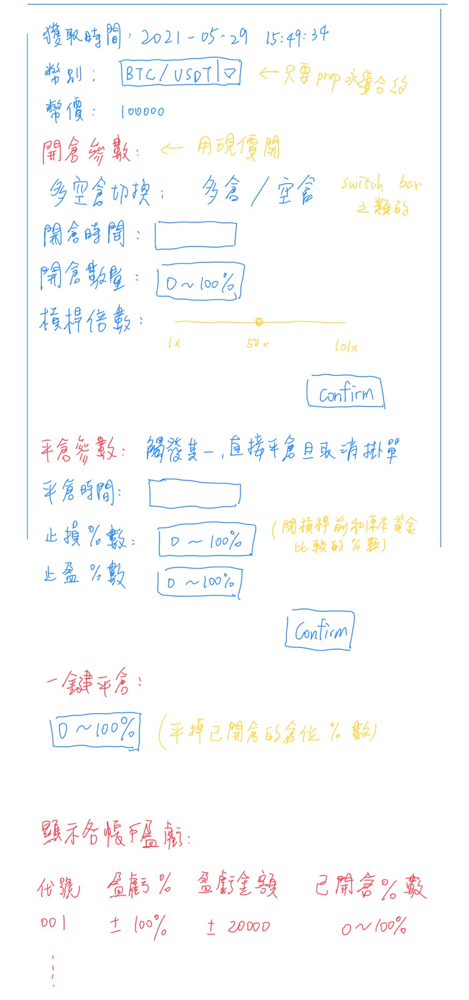

# Start

```
yarn install
yarn start
```

# CSS Framework

- [Tailwind CSS](https://tailwindcss.com/docs/guides/create-react-app)

# Design

- [MATERIAL-UI](https://material-ui.com/)

# 設計圖



# Reference

- [数字货币量化系统之 CCXT 框架使用 (上)](http://digtime.cn/articles/280/shu-zi-huo-bi-liang-hua-xi-tong-zhi-ccxt-kuang-jia-shi-yong)
